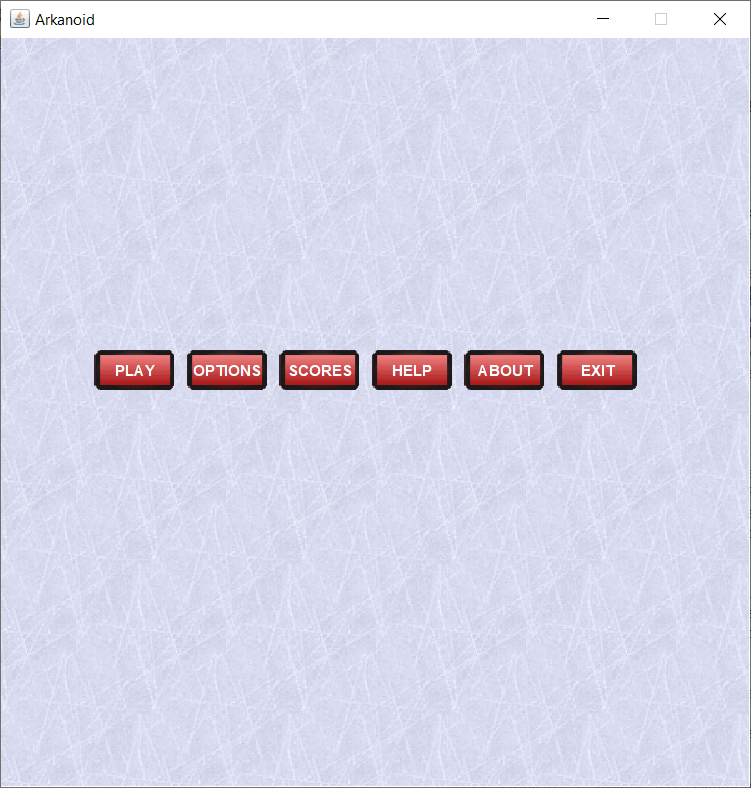

## arkanoid

Simple game project written in Java (JDK12) for a Software Development Methodologies course.

It is a classic brick breaker game where there is a paddle, a ball, and a set of bricks in the scene. The player controls the paddle and gives angle to the ball depending on where the ball hits the paddle. There are bricks of different types and it takes different number of hits to break each of them.

    

## Compilation

- `cd ./arkanoid/src`
- `javac ./main/java/*.java -d ../bin` 
- `cd ../bin`
- `cp ../src/main/resources/ ./main/resources -r`
- `java -classpath "." main.java.Game`
- Alternatively, just import the project to Eclipse.

## Design

In the project text, we are instructed to use only classes that derive from `JComponent`. Therefore, the objects in the game are mostly `JLabel, JButton, JTable, JScrollPane`. Since there are several pages (Home, Game, Options, Scores), a `CardLayout` has been used to switch between different pages. Only a single card is shown at any time to the user. There are lots of event listeners implemented for enabling the player to interact with the game with mouse or keyboard. Some of these which are visible to the user are:

| Action to be listened | Effect                                                  |
| --------------------- | ------------------------------------------------------- |
| Hit backspace         | Go back to home from the game, scores, or options page. |
| Press left arrow key  | Move the paddle to left.                                |
| Press right arrow     | Move the paddle to right.                               |
| Move mouse to left    | Move the paddle to left.                                |
| Move mouse to right   | Move the mouse to right.                                |
| Hit space             | Get the ball going in the play screen.                  |
| Press CTRL+Q          | Exit the game.                                          |

When the user clicks Play, the loop responsible for playing the game is started on a separate thread. This is necessary because sometimes we have to put the game thread to sleep and if we do so in the main thread which runs the GUI, the GUI cannot do its job properly. The solution is to run the game on a separate thread.  Then in such an environment we use locks for accessing and writing to the shared memory. For instance, we wait for a lock in the game loop which signals the space is pressed. The lock prevents the game thread from running an infinite loop which would block the GUI.

Setting up the main structure like this, the rest was a little bit physics and analytic geometry. Basically, there is physics involved when the ball hits either the paddle, the walls, or the bricks. One has to make design decisions about what happens when there is a collision. In this project, we enable the paddle to control the angle when the ball bounces.

    

The figure is taken from http://chrisdecoro.com/RealTimeGraphics/hw3writeup/RTG_HW3.htm. This assigns different velocity vectors to the ball depending on where the ball hits the paddle. It adds randomness to the game and gives control to the player. Otherwise the game would be boring if the paddle just reflected the ball with the same angle every time.

The collision detection is not hard to implement but it's not trivial too. In a current frame, one has to compute these collisions with respect to the next frame. This is necessary because otherwise you might miss a collision. You should not be detecting collisions in the current frame because the ball for example might have passed a brick already in the current frame. Keeping track of either the previous positions or computing the positions of the next frame is necessary. The ball-brick intersections are more demanding than the ball-paddle intersections because a ball can hit a brick in its 4 edges whereas in our implementation we let it hit the paddle only from the above (1 edge). In the code, we identified which surface a brick gets hit and the position of such a collision. These must be computed to update the ball's position and the velocity.

## Gameplay

As stated previously, there are 3 different pages in the game (Play, Options, Scores). The rest (Help, About, Exit) show texts as dialogs. In the Play section, the level is started as soon as the user hits space key. They can then use their mouse or arrow keys to move the paddle. The number of lives, score, and the current level is indicated at the top. The player may decide to hit backspace to stop playing at any time. They cannot continue playing, however, from the point they abandoned the game. They have to start a new game by clicking Play again. A pop-up appears when a level is cleared, or all levels are cleared, or the user has no more lives left. When a level is cleared, the next level is automatically loaded and again user has to press space to start the level. When game is over (no more lives, or no more levels), the game prompts the user to enter a name to store their score. 

The scores are ranked in descending order with respect to the score column and it only stores 10 entries. The options let a player select their paddle size and their starting level. There could have been more options provided but we kept it to minimum like this at the moment. 

The levels currently are random levels which is generated by a code that is taking the number of bricks desired as input and generates a level by randomly placing randomly typed bricks to the frame. For example, in this project, we let 10 bricks exist in the first level, 20 levels in the second, and 30 in the last. A cool extension to this project would be to implement a GUI for level-designing and then let this project take those generated levels as input to load those levels. Otherwise, it is hard to come up with beautifully designed levels by randomly placing the bricks.

## Graphics

They are taken from https://opengameart.org/content/basic-arkanoid-pack.  

 
